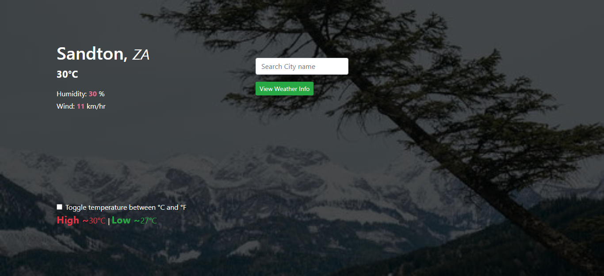

# The-Weather-Application

The Weather app is a simple application that uses the [Open Weather Map](https://api.openweathermap.org) API to retrieve weather information, in this case I made use of temperature ( high/low ), humidity and windspeed. In the input field, you can enter a city name of your choice & click on ( View Weather Info) button to review weather info for that particular city. There is an option to view temperature in fahrenheit or celcius -- click on the checkbox to do that. You can see the app in action by visiting the live demo link below.

## Landing page



## Live Link

[Live demo](https://the-sib-weather.netlify.app/)


## Technologies used:
- JavaScript programming language
- Bootstrap
- HTML & CSS
- Webpack
- .eslintrc (for validating js code).

## Setup the project on your machine:
To contribute to this project, run the following command on your terminal:
```
git clone https://github.com/ClaytonSiby/The-Weather-Application.git
```

Once you have the cloned the project & you are still on the terminal, run:
```
cd The-Weather-Application
```

And run the app on your local machine in the browser of your choice.

## Author

👤 Clayton Siby
- Github: [@Clayton Siby](https://github.com/ClaytonSiby)
- Twitter: [@ClaytonSiby](https://twitter.com/ClaytonSiby)
- Linkedin: [linkedin](https://www.linkedin.com/in/clayton-siby/)
- claytonsiby@gmail.com

## :handshake: Contributing

Contributions, issues and feature requests are welcome!
Feel free to check the [issues page](https://github.com/ClaytonSiby/The-Weather-Application/issues).

## Show your support

Give a :star:️ if you like this project!

## Acknowledgments

TBA

## :memo: License

TBA